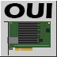

# TA_oui-lookup

A Splunk technology add-on (TA) to find the manufacturer of a device given the MAC address.

## Purpose

This TA maintains a lookup table containing the IEEE OUI reference table.
It provides macros for Splunk to be use at search-time to lookup the organizationally-unique identifier (OUI) portion of a medium access-control (MAC) address and emit a field containing the device manufacturer.

For example, a given search returns events with a field called `src_mac`.
The `src_mac` field contains a well-formed MAC address[^1].
The emphasized lines below will return a field `vendor` that contains the registered manufacturer of the device with that MAC address.

<pre>
src_mac = *
| stats count BY src_mac
<b>| `LOOKUP_OUI(src_mac)`</b>
</pre>

## Prerequisites and Dependencies

This TA is installed on the search tier only.

Search heads with this TA should have access to (the IEEE website) *standards-oui.ieee.org* on port 443/TCP to download updates to the lookup table.

## Developer

The TA was developed by Frank Wayne.

## Support Contact

Contact [the developer](mailto:frank.wayne@northwestern.edu?subject=TA_oui-lookup) with questions, bug reports or change requests. You can also refer or contribute to the [GitHub repository](https://github.com/thatfrankwayne/TA_oui-lookup).

[^1] A well-formed MAC address is a set of 12 hexadecimal digits with digit pairs optionally separated by a hyphen or a colon.
